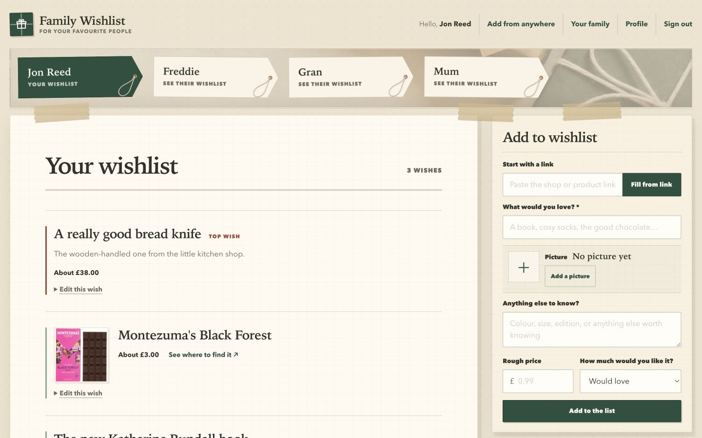

# Product design

## The feeling

Family Wishlist should feel like opening a parcel on the kitchen table: warm, useful, slightly
imperfect and unmistakably personal. It is a family tool, not a team dashboard or an online shop.

The interface uses paper, kraft tape, cotton string, gift tags and editorial still-life imagery as
quiet design cues. These materials should support the task rather than turn every control into a
novelty.

  

The desktop workspace brings the mark, family gift tags, paper list and taped add form together.

## Information architecture

The signed-in home has four stable regions:

1. **Identity:** the Family Wishlist mark, the current member and sign out.
2. **Family selector:** one looped-string gift tag per member over a quiet parcel-table image.
3. **Active wishlist:** one person's complete list, with an always-open add form alongside it on
   wider screens.
4. **Project footer:** source repository, licence, issue reporting, self-hosting and version.

The signed-in header is identical on every route for the same member. It always includes “Hello” and
their display name, Wishlists, Add from anywhere, Profile and Sign out; the family organiser also sees
Your family in the same position. Keep the current destination in place and mark it with a quiet strip
of parcel tape rather than removing its link or changing the navigation order.

Only one wishlist is rendered as the active working area. This prevents a family with many members
or long lists from becoming one enormous dashboard. The selected list is represented by a `list`
query parameter so it remains linkable and survives form actions.

The product model remains deliberately small: one member, one list. Birthdays, Christmas and other
occasions do not create separate list types. A wish can stay useful throughout the year.

**Add from anywhere** is a stable top-level destination rather than a profile-only setting. Its setup
page begins with a compact, ruled contents line that jumps directly to Android, iPhone/iPad or desktop
instructions. It should read as editorial navigation within the paper sheet, not a row of feature
cards. Android’s install-once Share-menu journey is followed by the iPhone and iPad Share Sheet
journey with a tap-by-tap Apple Shortcut recipe and the deployment-specific address ready to copy.
The desktop bookmarklet follows, called the “browser button” in family-facing copy, with a visual
demonstration of the drag from the real button towards a labelled bookmarks bar. Do not assume that a
conventional button label or an action name explains any unfamiliar setup interaction: name the menu,
search field, exact choice and visible result. Every route must explicitly end at an editable draft,
not imply that a wish is saved automatically.

Household administration lives on the separate, infrequently visited **Your family** page. It shows
joined people and those waiting for their first login, with an add form kept apart from the everyday
wishlist. Cloudflare policy terminology and deployment setup stay out of family-facing copy so the
normal list never feels like an admin console.

Sharing one person's ideas outside the family stays attached to that active wishlist. A visible
**Share this list** link belongs in the active list heading beside its wish count; it opens compact
controls to name, create or copy a sharing link without turning the normal list into an
administration page. Ask who the link is for, with an example such as “Uncle David”, and explain that
this private name helps the family recognise it later. Show the newly created address with a clear
copy control; after a reload, show that one or more sharing links are active without attempting to
recover their secrets from storage. Include a small link to Profile for reviewing or stopping active
links; do not duplicate the removal action in this popup. When five links are active, replace the
creation form with a clear explanation that one must first be stopped from Profile.

Profile is the persistent management surface for sharing links. Below personal details, show every
active link as a plain list with its private name, wishlist owner, the family member who made it, its
creation date, a route back to the wishlist and an explicit **Stop sharing this link** action. Explain
that each wishlist can have up to five active links and that each readable address is shown only when
made. Keep technical terms such as “revoke” out of family-facing controls and explanations.

The page calls the admin the “family organiser”. Waiting rows offer a prepared invitation to copy,
but must not claim that an email was sent: the application authorises the exact address and the
organiser shares the message through their preferred private channel. Status is plain text rather
than a pill or software-dashboard badge.

## Core journeys

### Adding or improving an idea

Any admitted member can choose a person, add a wish or expand “Edit this wish”. The add form stays in
reach beside the active list on laptop-sized screens and follows the list on small screens; edit
forms are disclosed beside the item they change. A new wish asks for its optional product link first
so the page can fill the name and GBP price when a shop shares them; the person checks that draft and
can change every value before adding it. A visible “Fill from link” control keeps this useful without
JavaScript, while pasting or leaving the link field triggers the same lookup when enhancement is
available. Adding a wish without a link remains supported. Titles, useful buying notes, an approximate
price and a human description of priority are enough.

In the saved list, put “Edit this wish” on its own line below the item content. Opening the editor must
not change the position or width of the image, metadata or claim controls above it. Label only the
exceptional **Top wish** and **Nice to have** priorities; ordinary wishes need no “Would love” marker.
Present top wishes first, ordinary wishes second and nice-to-have wishes last, with newer additions
first inside each group.

When a shop publishes a product image, show it as a modest square preview rather than turning the
wishlist into a catalogue grid. The picture is an editable convenience: it may be removed or replaced
before saving. Lead with the preview or a friendly “No picture yet” state; keep the direct picture
address behind explicit **Add picture** or **Change picture** controls so implementation language does
not dominate the form. Saved images support recognition beside the wish's written details; they do
not replace the wish name, and repeated adjacent alt text should be avoided.

### Quietly buying a gift

On someone else's list, “I’ll get this” is a direct, reversible action. The person choosing it can
mark the gift bought or leave it for someone else. Choices made by another person are informative
rather than actionable.

On the recipient's own list, claim data must not merely be hidden with CSS: it must be absent from
the server response. Do not spend permanent page space explaining this invariant. Keep the warm,
plain-language reassurance in project guidance instead: “If someone decides to get you something
from this list, we’ll keep it secret so the surprise isn’t spoiled.”

### Sharing ideas with wider family

The link-shared view is a calm, read-only paper list with the Family Wishlist mark, the person's name,
wish count and ordinary wish details. It has no signed-in navigation, editing, add or claim controls.
The absence of those controls is sufficient; do not add software-oriented explanations about what a
public visitor cannot do.

### Finding the right person

Member navigation uses paper gift tags with a visible cotton-string loop through each tag hole and a
clear active state. The grid always begins at the left edge of the family board, including when it
contains a single tag, and a single tag stays tag-sized rather than stretching across the page. Tags
should remain compact enough for at least six to share a typical desktop row when space permits. They
may wrap into additional rows and must work with long display names. They are navigation, not filter
chips.

The tag body, layout and states remain responsive HTML and CSS. The reinforced hole and fibrous cord
use the small transparent
[`public/images/tag-string-hanging.png`](../public/images/tag-string-hanging.png) cut-out. Its eyelet
is anchored at the tag hole and its loose loop falls down and left under gravity, so the material
detail and physical direction do not depend on fragile CSS drawing.

## Visual language

### Type

- Display: Iowan Old Style with Palatino and Georgia fallbacks. Use it for the mark and important
  human headings.
- Interface: Avenir Next with Trebuchet and system fallbacks. Do not download third-party fonts; this
  keeps setup private, fast and self-contained.
- Small uppercase copy is reserved for labels and orientation, never paragraphs.

### Colour

- Canvas: warm wrapping-paper cream.
- Paper: quiet off-white.
- Ink: soft charcoal rather than pure black.
- Evergreen: the primary action and identity colour.
- Kraft: tape, edging and physical detail.
- Brick red: high-priority and destructive emphasis.
- Sage: ordinary priority and calm status.

Colours must retain sufficient contrast without resorting to saturated software-product blues.

### Shape and depth

- Corners are square or very slightly softened—never full capsules.
- Paper sheets may use grounded offset shadows, faint fibres and small rotations.
- Tape and string are occasional accents, not borders around every section. A tape piece should
  normally bridge two adjacent surfaces; avoid stacking pieces on the same seam.
- Two restrained tape pieces bridge the canvas and footer so the final dark paper layer feels held
  to the page without crowding its links.
- Wishlist items are rows separated by rules. They are not nested cards.
- Buttons are rectangular and tactile. Links remain recognisable as links.

### Imagery

The family selector uses
[`public/images/parcel-table.webp`](../public/images/parcel-table.webp), a purpose-built editorial
still life with year-round wrapping materials. It is faded beneath the family’s gift tags and remains
a decorative CSS background, so it does not add redundant alternative text. It has no marketing copy:
the family names are the useful content. Keep it shallow enough that the start of the active wishlist
is visible in the first viewport.

On wider screens, use the available horizontal space as a working surface rather than scaling the
image up. Let the active list use the main column and keep its add form in a taped, sticky side panel.
Collapse this to a natural single-column reading order on smaller screens.

New imagery should be natural, asymmetrical and materially believable. Avoid readable text, logos,
Christmas-only motifs, glossy catalogue lighting and perfect 3D-rendered parcels. Optimise assets to
WebP before committing them.

## Avoiding generic generated UI

Do not drift towards the common visual shorthand of generated SaaS pages:

- no purple or aurora gradients;
- no glowing blurred background orbs;
- no glass panels or backdrop-blur decoration;
- no centred marketing hero followed by three identical feature cards;
- no rows of pills or rounded filter chips;
- no nested rounded cards for every piece of content;
- no generic “streamline”, “unlock” or “revolutionise” copy;
- no fabricated testimonials, metrics or decorative analytics;
- no icon next to every heading simply to fill space.

Asymmetry must still be intentional, and tactile detail must never reduce legibility or keyboard use.

## Content voice

Copy is plain, warm British English. Describe what the family is doing, not how the product is
modelled. Prefer “wish”, “gift”, “family” and “I’m getting this” to system language such as claim,
recipient, priority, resource, workspace, role or permission. Empty states should be reassuring and
specific. Avoid forced whimsy: one human phrase is enough.

Describe Workers AI as product-detail assistance, enrichment or completion—not as a fallback. It is a
positive capability that turns a link into a better editable draft. Reserve “fallback” for genuine
resilience behaviour such as a manual form remaining available when another service cannot respond.

## Accessibility and interaction

- Use semantic headings, regions, lists, navigation and ordinary HTML forms.
- Maintain visible keyboard focus on every interactive element.
- Keep controls at least 44 CSS pixels high where they are primary touch targets.
- Do not rely on colour alone for priority, selection or claim state.
- Respect reduced-motion preferences.
- Preserve progressive enhancement: core list and claim actions must work without client JavaScript.
- Check both a 390-pixel mobile viewport and a 1280-pixel desktop viewport before release.

The design should continue to meet WCAG AA. Automated checks are a floor; long names, long wish
titles, expanded forms, empty lists and multiple family members all need visual review.
